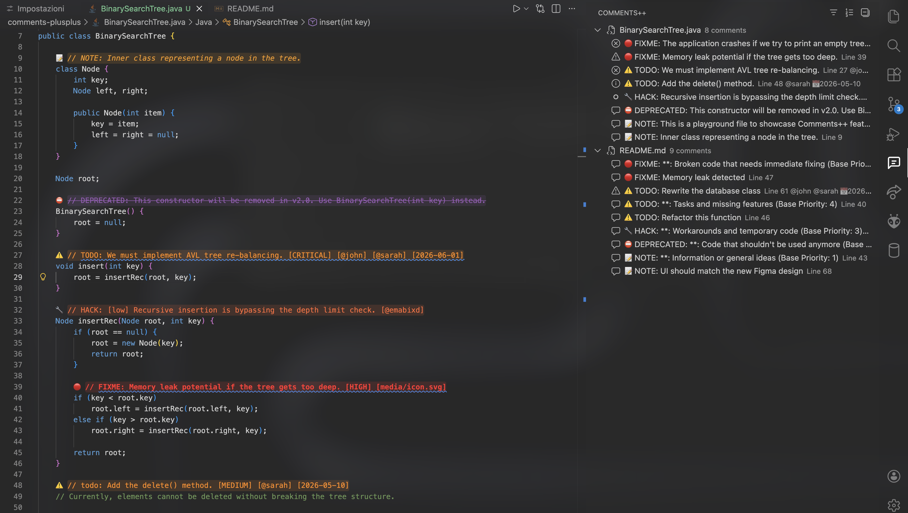
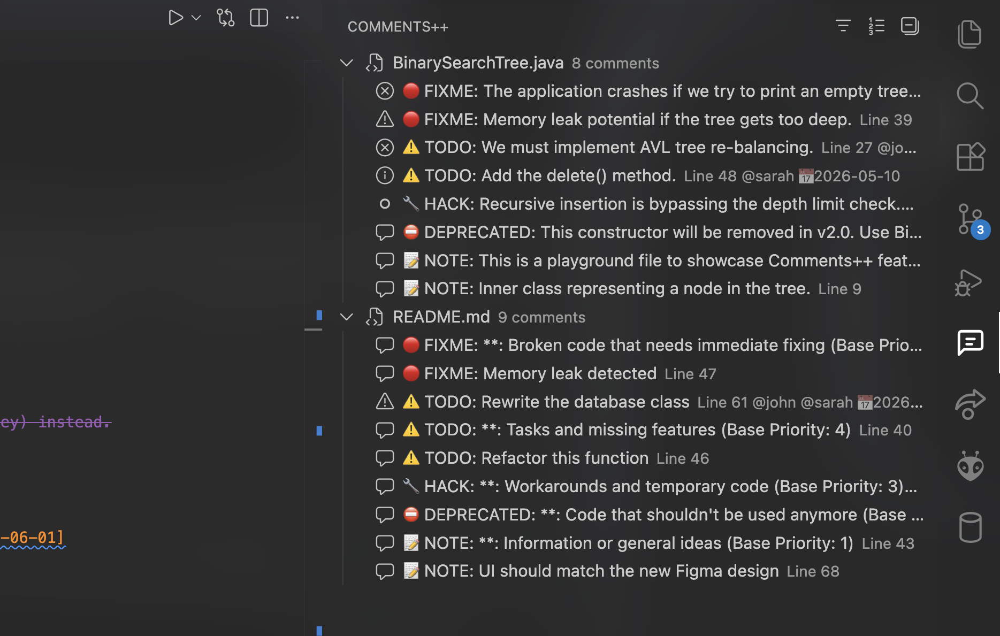
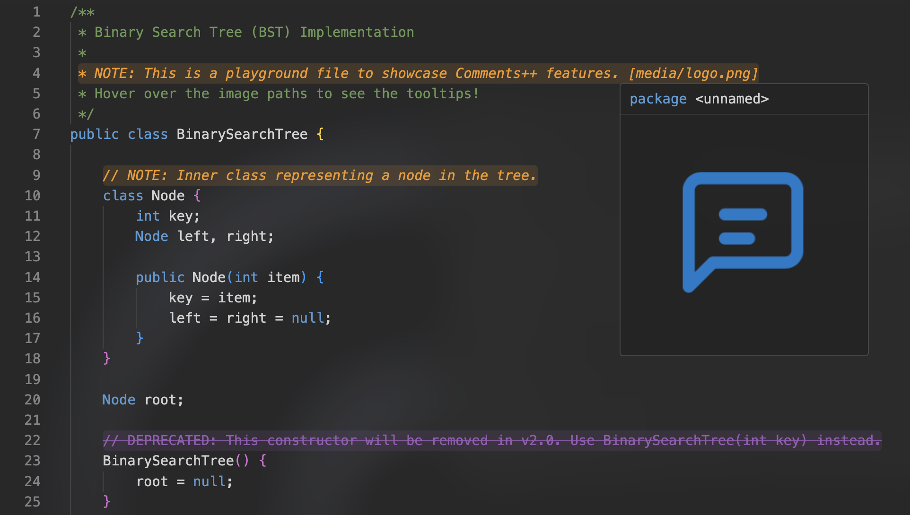

<div align="center">
  <h1>Comments++</h1>
  <p><b>Supercharge your code comments. Track technical debt, assign tasks, set deadlines, and preview images directly in your editor.</b></p>
</div>

 <!-- PLACEHOLDER: Metti qui lo screenshot principale dell'editor coi vari colori -->

---

**Comments++** turns static code comments into an interactive task management and documentation system.
Track `TODO`s and `FIXME`s with a dedicated sidebar, advanced filtering, image hover tooltips, and rich metadata parsing.

## 📸 Screenshots

<!-- PLACEHOLDER: Aggiungi qui gli screenshot dell'estensione in azione -->
| Action Sidebar | Image Previews on Hover |
| :---: | :---: |
|  |  |

## Key Features & Full Support

*   **Customizable Highlighting:** Highlight `TODO`, `FIXME`, `NOTE`, `BUG`, `HACK`, `XXX` out of the box, or create custom tags via settings.
*   **Universal Language Support:** Seamlessly works across virtually ALL programming languages that use block or line-level comments (`//`, `#`, `/* ... */`, `*`). 
*   **Dedicated Sidebar Explorer:** View and manage all your comments across the current file, open files, or the entire workspace.
*   **Rich Metadata inside Brackets:** Assign authors, priorities, and due dates effortlessly by typing them inside `[...]`.
*   **Image Previews on Hover:** Link local image paths or external URLs directly inside a comment. Hover over the comment to see the image instantly!
*   **Advanced Filtering:** Filter workspace comments by Tags, Author, Date Range, Image presence, or search text.
*   **Export to Markdown/JSON:** Generate reports of your filtered task lists to share with your team.
*   **Extremely Fast:** Optimized filesystem reading parses your entire workspace without slowing down your editor.

---

## How It Works (Syntax)

Comments++ parses standard comments and extracts metadata placed inside square brackets `[...]`.

### 1. Default Tags
By default, the extension recognizes these keywords immediately following a comment symbol:
*   🔴 **FIXME**: Broken code that needs immediate fixing (Base Priority: 5)
*   ⚠️ **TODO**: Tasks and missing features (Base Priority: 4)
*   🔧 **HACK**: Workarounds and temporary code (Base Priority: 3)
*   ⛔ **DEPRECATED**: Code that shouldn't be used anymore (Base Priority: 2)
*   📝 **NOTE**: Information or general ideas (Base Priority: 1)

```typescript
// TODO: Refactor this function
// FIXME: Memory leak detected
```

### 2. Adding Metadata (Author, Date, Priority)
Place metadata spaced out or mixed anywhere inside the comment using brackets:
*   **Authors:** You can assign multiple authors separated by spaces or in different brackets (e.g., `[@john @sarah]` or `[@john] [@sarah]`).
*   **Due Dates:** `[YYYY-MM-DD]`. You can specify multiple dates for ranges tracking (e.g., `[2026-05-20] [2026-06-01]`).
*   **Priority:** Inject extra urgency using `[CRITICAL]`, `[HIGH]`, `[MEDIUM]`, or `[LOW]`. If you define multiple priorities inside the comment, only the highest one is mapped to the sidebar, while the others remain visible as normal text.

#### The Priority & Ranking System
When sorting the Sidebar by "Priority", Comments++ uses a formula based on **Base Tag Priority + Bracket Priority**. 
A bracket priority like `[CRITICAL]` or `[HIGH]` boosts a comment's ranking *within its tag group*. This means a `TODO [CRITICAL]` will rank higher than a normal `TODO`, allowing you to quickly spot what needs your attention first.

```python
# TODO [@john] [@sarah] [2026-05-20] [2026-06-01] [HIGH] Rewrite the database class
```

### 3. Image Tooltips
Drop an image path or URL in brackets to display it in a square tooltip popup on hover. Supported formats: `.png`, `.jpg`, `.jpeg`, `.gif`, `.svg`, `.webp`, and `http://`/`https://` links.

```javascript
// NOTE: UI should match the new Figma design [assets/mockup.png]
// BUG: CSS misaligned on mobile [https://example.com/bug.jpg]
```

---

## Sidebar & Management

Press the Comments++ icon in the VS Code Activity Bar to open the built-in Tree View.
From the top menu of the panel, you can:
*   **Filter** by particular tags (e.g., show only `CRITICAL` or `TODO`).
*   **Filter** by Date Range (e.g., tasks due before next week).
*   **Filter** by Author.
*   **Sort** by Priority, Line Number, or Chronological Due Date.
*   **Click** any task to instantly jump to that line of code.

---

## Extension Settings

Comments++ is highly customizable. Search for `Comments++` in your VS Code Settings:

| Setting | Description | Default |
| --- | --- | --- |
| `commentsPlusPlus.tags` | Add or modify tags, icons, text colors, background colors, and base priorities. | `TODO`, `FIXME`, `NOTE`, etc. |
| `commentsPlusPlus.showInlineIcons` | Show icons inline next to comments. | `true` |
| `commentsPlusPlus.showBackground` | Show background color on comment lines. | `true` |
| `commentsPlusPlus.highlightScope` | Highlight the entire `line` or just the `comment` text keyword. | `comment` |
| `commentsPlusPlus.showImageHovers` | Enable displaying images in a popup when hovering over comments. | `true` |
| `commentsPlusPlus.imageScale` | Scaling factor for image previews in the hover tooltip. (1 = normal, 0.5 = half). | `1` |
| `commentsPlusPlus.sidebar.defaultFilter` | Default file filter for the sidebar (`entireWorkspace`, `openFiles`). | `entireWorkspace` |
| `commentsPlusPlus.searchIncludes` | Glob pattern for files to include when building the full workspace tree. | `**/*.{ts,js,py,...}` |
| `commentsPlusPlus.searchExcludes` | Glob pattern for folders/files to exclude when building the full workspace tree. | `**/{node_modules...}` |

### Creating Custom Tags
To create a fully personalized keyword (like `REVIEW:`), simply open your `settings.json` and add a new object inside `"commentsPlusPlus.tags"`:

```json
"commentsPlusPlus.tags": [
  {
    "tag": "REVIEW",
    "color": "#00FF00",
    "backgroundColor": "#00FF0022",
    "icon": "👀",
    "priority": 4
  }
]
```
With the configuration above, any line stating `// REVIEW` will spawn a bright green highlight, inherit the base priority rank (4), and display the 👀 icon in the sidebar.

---

## Exporting Reports
Need to share your technical debt or tasks in a meeting? Apply your filters in the sidebar, click the **Export** icon, and generate a Markdown (`.md`) or JSON report containing exactly the comments you see on screen.

---

### Contributing & Feedback
If you love Comments++, please leave a rating on the Marketplace! Encountered a bug or have a feature request? Open an issue on our GitHub repository.

**Happy Coding!**